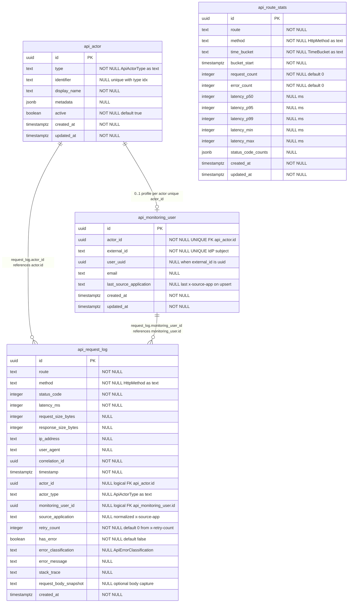

# ERD — `@exprealty/api-monitoring` (PostgreSQL `core` schema)

This document is the **schema reference** for API monitoring: **logical associations**, a **Mermaid ERD**, **column tables**, **HTTP header contracts**, **monorepo migrations**, and **enum values**. Entity definitions match **`@exprealty/api-monitoring`** TypeORM entities (v0.2.x). All tables live in schema **`core`**.

## Contents

- [Logical relationships](#logical-relationships)
- [Association types and notes](#association-types-cardinality)
- [Request lifecycle (USER)](#request-lifecycle-user)
- [Monorepo migrations](#monorepo-migrations)
- [Diagram (Mermaid)](#diagram-mermaid)
- [Table: `core.api_actor`](#table-coreapi_actor)
- [Table: `core.api_monitoring_user`](#table-coreapi_monitoring_user)
- [Table: `core.api_request_log`](#table-coreapi_request_log)
- [Table: `core.api_route_stats`](#table-coreapi_route_stats)
- [Uniqueness quick reference](#uniqueness-quick-reference)
- [Enum values stored as `text`](#enum-values-stored-as-text)
- [Rendering the diagram](#rendering-the-diagram)

---

## Logical relationships

- **`core.api_request_log.actor_id`** references **`core.api_actor.id`** (same UUID). The package stores this as a plain column; there is **no TypeORM `@ManyToOne` / DB `FOREIGN KEY`** in the published entity — enforce at the DB layer only if your org requires it.
- **`core.api_request_log.correlation_id`** identifies **one HTTP request** in logs (typically a new UUID per request from your async context). Replays may reuse the same value if your gateway does; otherwise each call gets a new id.
- **`core.api_monitoring_user.actor_id`** references **`core.api_actor.id`** (logical). **`actor_id` is UNIQUE** on `api_monitoring_user`: **at most one profile row per actor** (no two profiles may share the same `actor_id`). One profile row per stable **`external_id`** (also UNIQUE), linked to the USER actor created by middleware.
- **`core.api_request_log.monitoring_user_id`** references **`core.api_monitoring_user.id`** (logical). Set when `ApiActorType.USER` was resolved and `ApiMonitoringUserService` upserted a profile for that request.
- **`core.api_request_log.source_application`** stores the normalized HTTP header **`x-source-app`** when present (e.g. `IMS`, `TRX`, deal desk). This is a **per-request** dimension: many humans can call from many apps; each log row records **one** user (when `monitoring_user_id` is set) and **one** source-app label for that HTTP call. There is **no separate “applications” table** and **no many-to-many** between users and apps—analytics use `GROUP BY` on `source_application` and/or joins to `api_monitoring_user`.
- **`core.api_request_log.retry_count`** stores **`x-retry-count`**: **0** for the original attempt (default), **1** for the first replay after a failure, **2** for the second, and so on. Each replay is a **new** log row; correlate replays with the same **`correlation_id`** (or your own idempotency key) if your pipeline sets it consistently across attempts.
- **`core.api_monitoring_user.last_source_application`** is updated on profile upsert when `x-source-app` is sent (convenience only; authoritative per-call app is on each `api_request_log` row).
- **`core.api_route_stats`** is **aggregated** from request logs (route + method + time bucket). There is **no foreign key** to `api_request_log` or `api_actor`.

### Association types (cardinality)

There are **no many-to-many** relationships between these four monitoring tables: there is **no join table** linking pairs of entities (e.g. no `api_request_log` ↔ `api_actor` through an intersection table). Links are **scalar UUID columns** only.

| From | To | Cardinality | Notes |
|------|-----|-------------|--------|
| `api_request_log` | `api_actor` | **Many-to-one** | Many log rows can share the same `actor_id` (same caller over time). |
| `api_request_log` | `api_monitoring_user` | **Many-to-one** | Many log rows can share the same `monitoring_user_id` (same human over time). Nullable when the caller has no USER profile row. |
| `api_monitoring_user` | `api_actor` | **Many-to-one** (each profile → one actor) **+ UNIQUE(`actor_id`)** | Each profile has exactly one `actor_id`. **`actor_id` is UNIQUE**, so each actor has **at most one** profile row (0 or 1 per actor — API keys and other non-USER actors typically have 0). |
| `api_route_stats` | *(other monitoring tables)* | **None (no FK)** | Stats are **derived** aggregates; no row-level link in this schema. |

**Note — how associations show up in practice**

- **One HTTP request → one new `api_request_log` row** (always). The same person calling again adds **another** log row with the **same** `actor_id` / `monitoring_user_id` as before (when USER + profile exist).
- **`source_application`** (e.g. `IMS` for many users) is **not** a foreign key: many unrelated log rows can repeat the same text. **Uniqueness of people** is **`api_actor (type, identifier)`** and **`api_monitoring_user.external_id`**, not the app label.
- **`api_monitoring_user` → `api_actor`:** each profile references one actor; **`UNIQUE(actor_id)`** enforces **at most one profile per actor**. Not every `api_actor` has a profile (e.g. `api_key`). For a USER with a profile, this is **one-to-one** between that actor row and that profile row.
- **Replay / retry:** each replay should be a **new** `api_request_log` row; use **`retry_count`** (`x-retry-count`) and optionally the same **`correlation_id`** across attempts if your gateway sets it that way.

**Migration note:** If your database was created before **`uq_api_monitoring_user_actor_id`**, run the platform migration **`UniqueApiMonitoringUserActorId1772320000000`** (drops `idx_api_monitoring_user_actor`, creates the unique index). **Resolve duplicate `actor_id` values first**, or the migration will fail.

**TypeORM:** Entities use **plain `@Column` UUIDs**, not `@ManyToOne` / `@OneToMany` / `@ManyToMany` in the published package.

**PostgreSQL:** Relationships are **logical** unless your team adds `FOREIGN KEY` constraints.

---

## Request lifecycle (USER)

Typical order in a Nest app (see package README for wiring):

1. **Correlation / async context** — e.g. generate or read **`correlation_id`** and store it for the request.
2. **`ApiActorMiddleware`** (after auth) — **`getOrCreateActor`** → row in **`api_actor`**; for **`ApiActorType.USER`**, **`upsertForUserActor`** → row in **`api_monitoring_user`** (keyed by **`external_id`**, **`actor_id`** updated, subject to **`UNIQUE(actor_id)`** / **`UNIQUE(external_id)`**); **`ApiRequestContextService`** stores **`actor_id`**, **`monitoring_user_id`**, etc.
3. **Controller / handler** — business logic.
4. **`ApiMonitoringInterceptor`** — reads **`x-source-app`**, **`x-retry-count`**, optional body snapshot; **`buildRequestMetadata`** + **`logRequest`** → new row in **`api_request_log`** (skipped if **`actor_id`** missing in context).

Anonymous or non-USER actors: steps differ (no **`api_monitoring_user`** upsert); **`monitoring_user_id`** on the log may be null.

---

## Monorepo migrations

Relevant files under **`packages/database/src/migrations/`** (names may vary slightly; check the repo):

| Topic | Typical migration (class name pattern) |
|--------|----------------------------------------|
| Base API monitoring tables (`api_actor`, `api_request_log`, `api_route_stats`, …) | `CreateApiMonitoringTables*`, `AddApiMonitoringIndexes*`, … |
| **`api_monitoring_user`** + **`monitoring_user_id`** on logs | `CreateApiMonitoringUserTable1770100000000` |
| **`request_body_snapshot`** | `AddApiRequestLogRequestBodySnapshot*` |
| **`source_application`**, **`last_source_application`** | `AddSourceApplicationToApiMonitoring1772300000000` |
| **`retry_count`** | `AddRetryCountToApiRequestLog1772310000000` |
| **UNIQUE(`actor_id`)** on **`api_monitoring_user`** | `UniqueApiMonitoringUserActorId1772320000000` |

Run via your platform’s TypeORM migration command (e.g. `pnpm run migration:run` from the monorepo root when using `@exprealty/database`).

---

## Diagram (Mermaid)

Attributes below match the TypeORM entities (PostgreSQL `core`). **Indexes** are listed in the table sections after the diagram, not inside the entity blocks.

---

## Table: `core.api_actor`

| DB column | Type | Nullable | Notes |
|-----------|------|----------|--------|
| `id` | `uuid` | NO | PK, generated |
| `type` | `text` | NO | `ApiActorType` (see enums below) |
| `identifier` | `text` | YES | With `type`, unique (`idx_api_actor_type_identifier` unique) |
| `display_name` | `text` | NO | |
| `metadata` | `jsonb` | YES | Arbitrary JSON |
| `active` | `boolean` | NO | Default `true` |
| `created_at` | `timestamptz` | NO | |
| `updated_at` | `timestamptz` | NO | |

**Indexes:** unique `(type, identifier)`; `created_at`.

---

## Table: `core.api_monitoring_user`

| DB column | Type | Nullable | Notes |
|-----------|------|----------|--------|
| `id` | `uuid` | NO | PK |
| `actor_id` | `uuid` | NO | Logical → `api_actor.id` (USER actor). **UNIQUE** (`uq_api_monitoring_user_actor_id`) |
| `external_id` | `text` | NO | Stable unique key (e.g. Cognito `sub`, internal user id). **UNIQUE** |
| `user_uuid` | `uuid` | YES | Set when `external_id` parses as a UUID |
| `email` | `text` | YES | From auth / headers when available |
| `last_source_application` | `text` | YES | Last non-empty `x-source-app` seen when the profile is upserted |
| `created_at` | `timestamptz` | NO | |
| `updated_at` | `timestamptz` | NO | |

**Indexes:** unique `external_id` (`uq_api_monitoring_user_external_id`); **unique `actor_id`** (`uq_api_monitoring_user_actor_id`).

Populated by **`ApiMonitoringUserService.upsertForUserActor`** from **`ApiActorMiddleware`** when `ApiActorType.USER` is resolved (`metadata.userId` / identifier + email). When the request includes **`x-source-app`**, that value is passed into the upsert and stored in **`last_source_application`** (and on each **`api_request_log`** row via the interceptor).

---

## Table: `core.api_request_log`

| DB column | Type | Nullable | Notes |
|-----------|------|----------|--------|
| `id` | `uuid` | NO | PK, generated |
| `route` | `text` | NO | Matched route / path |
| `method` | `text` | NO | HTTP verb (`HttpMethod`) |
| `status_code` | `integer` | NO | HTTP status |
| `latency_ms` | `integer` | NO | |
| `request_size_bytes` | `integer` | YES | |
| `response_size_bytes` | `integer` | YES | |
| `ip_address` | `text` | YES | |
| `user_agent` | `text` | YES | |
| `correlation_id` | `uuid` | NO | Per-request correlation |
| `timestamp` | `timestamptz` | NO | Event time |
| `actor_id` | `uuid` | YES | → `api_actor.id` (logical) |
| `actor_type` | `text` | YES | Redundant type for queries |
| `monitoring_user_id` | `uuid` | YES | → `api_monitoring_user.id` (logical), USER flows |
| `source_application` | `text` | YES | Normalized **`x-source-app`** (client label: `IMS`, `TRX`, etc.) |
| `retry_count` | `integer` | NO | Default **`0`**; **`x-retry-count`** — replay counter (0 = first attempt) |
| `has_error` | `boolean` | NO | Default `false` |
| `error_classification` | `text` | YES | `ApiErrorClassification` |
| `error_message` | `text` | YES | |
| `stack_trace` | `text` | YES | Often server errors only |
| `request_body_snapshot` | `text` | YES | UTF-8 snapshot when `captureRequestBody` is enabled |
| `created_at` | `timestamptz` | NO | Row insert time |

**Indexes (TypeORM / typical names):** `idx_api_request_log_timestamp` (`timestamp`); `idx_api_request_log_route_method` (`route`, `method`); `idx_api_request_log_actor` (`actor_id`, `timestamp`); `idx_api_request_log_correlation` (`correlation_id`); `idx_api_request_log_status` (`status_code`, `timestamp`); `idx_api_request_log_error` (`has_error`, `timestamp`); `idx_api_request_log_monitoring_user` (`monitoring_user_id`, `timestamp`); `idx_api_request_log_source_app` (`source_application`, `timestamp`).

**Header contract — source app:** Upstream gateways or apps should send **`x-source-app`**: a short stable name for the calling product. The package reads it in **`ApiMonitoringInterceptor`** (every logged request) and in **`ApiActorMiddleware`** when upserting **`api_monitoring_user`**. Values are trimmed and limited to **64** characters; see **`parseSourceApplicationHeader`** and **`API_MONITORING_SOURCE_APP_HEADER`** on the package entry.

**Header contract — retries:** When **replaying** a failed call, send **`x-retry-count`** with a non-negative integer: **0** (or omit) for the first try, **1** for the first replay, etc. Parsed in **`ApiMonitoringInterceptor`** only; see **`parseRetryCountHeader`** and **`API_MONITORING_RETRY_COUNT_HEADER`**. Invalid values are stored as **0**; values above **10000** are clamped.

---

## Table: `core.api_route_stats`

| DB column | Type | Nullable | Notes |
|-----------|------|----------|--------|
| `id` | `uuid` | NO | PK, generated |
| `route` | `text` | NO | |
| `method` | `text` | NO | |
| `time_bucket` | `text` | NO | `minute` \| `hour` \| `day` |
| `bucket_start` | `timestamptz` | NO | Start of bucket |
| `request_count` | `integer` | NO | Default `0` |
| `error_count` | `integer` | NO | Default `0` |
| `latency_p50` | `integer` | YES | ms |
| `latency_p95` | `integer` | YES | ms |
| `latency_p99` | `integer` | YES | ms |
| `latency_min` | `integer` | YES | ms |
| `latency_max` | `integer` | YES | ms |
| `status_code_counts` | `jsonb` | YES | e.g. counts per status |
| `created_at` | `timestamptz` | NO | |
| `updated_at` | `timestamptz` | NO | |

**Constraints / indexes:** **Unique** `(route, method, time_bucket, bucket_start)` (`uq_api_route_stats_route_method_bucket`); indexes on `bucket_start`, `(route, method)`.

---

## Uniqueness quick reference

| Table | Constraint / index | Column(s) |
|-------|-------------------|-----------|
| `api_actor` | `idx_api_actor_type_identifier` (unique) | `(type, identifier)` |
| `api_monitoring_user` | `uq_api_monitoring_user_external_id` | `external_id` |
| `api_monitoring_user` | `uq_api_monitoring_user_actor_id` | `actor_id` |
| `api_route_stats` | `uq_api_route_stats_route_method_bucket` | `(route, method, time_bucket, bucket_start)` |

---

## Enum values stored as `text`

**`HttpMethod`:** `GET`, `POST`, `PUT`, `PATCH`, `DELETE`, `HEAD`, `OPTIONS`

**`ApiActorType`:** `user`, `api_key`, `service_account`, `anonymous`, `system`

**`ApiErrorClassification`:** `client_error`, `server_error`, `validation_error`, `auth_error`, `rate_limit_error`, `timeout_error`, `unknown_error`

**`TimeBucket`:** `minute`, `hour`, `day`

---

## Rendering the diagram

- **GitHub / GitLab:** Mermaid is supported in Markdown previews for many versions.
- **VS Code:** “Markdown Preview Mermaid Support” or similar extension.
- **Export PNG/SVG:** [Mermaid Live Editor](https://mermaid.live) — paste the `erDiagram` block.

---

*This file tracks `@exprealty/api-monitoring` entities and related `packages/database` migrations; verify against your installed package version if types or migration names differ.*
