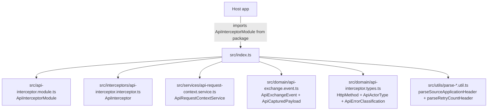
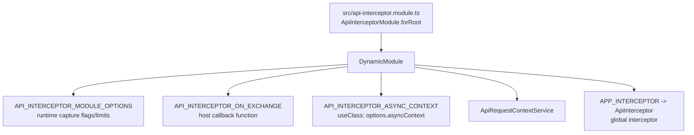
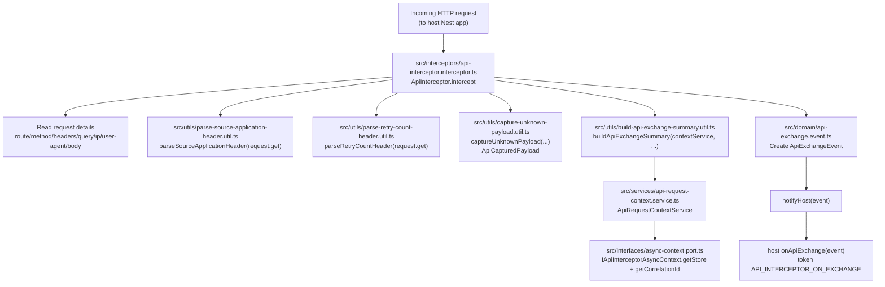

# File-to-file flow (arrows) — `@exprealty/api-interceptor`

This page shows how the **main source files** in this package **point to each other** (imports/exports) and where they’re **consumed at runtime**.

## Public entry (what consumers import)

## Registration wiring (what `forRoot` sets up)

## Runtime flow (what happens per request)

## Numbered call sequence (what gets called when)

This is the typical order of function calls for one request.

1. **Host registers module (startup)**
   - `ApiInterceptorModule.forRoot(options)` in `src/api-interceptor.module.ts`
     - validates `options.onApiExchange`
     - clamps `exchangePayloadMaxBytes`
     - registers providers including `APP_INTERCEPTOR -> ApiInterceptor`

2. **Request hits Nest (per request)**
   - `ApiInterceptor.intercept(context, next)` in `src/interceptors/api-interceptor.interceptor.ts`
     - reads `request`/`response` from `ExecutionContext`
     - `startedAtMs = Date.now()`

3. **Skip decision (early)**
   - `shouldSkipIntercept(request)`
     - if **skipped**:
       - `captureUnknownPayload(request.body, ...)` (optional)
       - `resolveRequestRoute(request)`
       - `mapHttpMethod(request.method)`
       - `parseSourceApplicationHeader((n) => request.get(n))`
       - `parseRetryCountHeader((n) => request.get(n))`
       - `buildRequestSnapshot(request, bodyCapture)`
       - `buildContextSnapshot()`
       - `buildApiExchangeSummary(contextService, ...)`
       - `notifyHost(event)` → calls host `onApiExchange(event)`
       - returns `next.handle()` (controller still runs)

4. **Normal tracking setup (not skipped)**
   - `contextService.setStartTime()` (writes to async store if present)
   - Reads route/method/ip/UA/sizes and headers:
     - `resolveRequestRoute`, `mapHttpMethod`, `extractIpAddress`, `calculateRequestSize`
     - `parseSourceApplicationHeader`, `parseRetryCountHeader`
   - Captures request body (optional):
     - `captureUnknownPayload(request.body, maxCapture)`

5. **Run the real controller**
   - returns `next.handle().pipe(...)`

6. **On success (after controller returns a value)**
   - RxJS `tap({ next })` runs:
     - reads `response.statusCode`
     - `captureUnknownPayload(data, maxCapture)` for response body (optional)
     - `buildApiExchangeSummary(contextService, ...)`
     - `buildRequestSnapshot(...)`, `buildContextSnapshot()`
     - `notifyHost({ phase: 'completed', ... })` → host `onApiExchange(event)`

7. **On error (after controller throws)**
   - RxJS `catchError(err)` runs:
     - derives `statusCode` (from `response.statusCode` or `err.status`)
     - `captureUnknownPayload(err, maxCapture)`
     - `buildApiExchangeSummary(contextService, ...)`
     - `buildRequestSnapshot(...)`, `buildContextSnapshot()`
     - `notifyHost({ phase: 'error', ... })` → host `onApiExchange(event)`
     - rethrows the error so Nest handles it normally

## Who consumes what (quick list)

- **Host app consumes**
  - `ApiInterceptorModule.forRoot({ asyncContext, onApiExchange, ... })`
  - `ApiRequestContextService` (optional; to write actor info to the async store)
  - `ApiExchangeEvent` types (to type `onApiExchange`)

- **Interceptor consumes**
  - `ApiRequestContextService` (async context reads/writes)
  - `captureUnknownPayload` (payload snapshots)
  - `buildApiExchangeSummary` (summary row)
  - `parseSourceApplicationHeader` / `parseRetryCountHeader` (header extraction)

