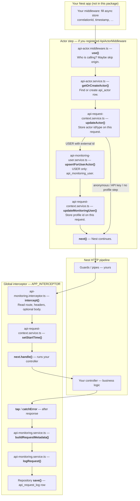

# Request flow — from first code to saved log

This page shows **where one HTTP request goes** in `@exprealty/api-monitoring`, in order. Wording is kept simple; file names are **paths under `src/`** (add `packages/api-monitoring/` in the repo).

> **Your app runs first.** Anything you register *before* this package (body parser, CORS, **your** correlation-id middleware) runs before the steps below. This diagram starts at the usual “monitoring” entry points.

---

## Files grouped by role (whole package)

Paths are under **`src/`** inside `@exprealty/api-monitoring`. Similar jobs sit together; **sequence** within each group follows how the app normally runs.

### 1. Composition & wiring (app bootstrap)

| File | What it does |
|------|----------------|
| `api-monitoring.module.ts` | **`forRoot()`**: registers TypeORM entities, repo DI tokens, logger/async-context bridges, services, global interceptor, controller. |
| `options/api-monitoring-for-root.options.ts` | Types for `forRoot` (entities, connection name, body capture, outcome headers). |
| `tokens/repository.tokens.ts` | Symbols for injecting request-log, route-stats, actor, user repos. |
| `tokens/entity-classes.token.ts` | Token + types for the entity class bundle (metrics queries need metadata). |
| `tokens/api-monitoring-module-options.token.ts` | Runtime flags injected into the interceptor (capture limits, outcome headers). |
| `entities/default-entities.ts` | Default export bundle of the four monitoring entities. |
| `entities/api-request-log.entity.ts` | TypeORM model for **`core.api_request_log`**. |
| `entities/api-route-stats.entity.ts` | TypeORM model for **`core.api_route_stats`** (rollups). |
| `entities/api-actor.entity.ts` | TypeORM model for **`core.api_actor`**. |
| `entities/api-monitoring-user.entity.ts` | TypeORM model for **`core.api_monitoring_user`**. |
| `domain/api-monitoring.types.ts` | Shared enums/types (`HttpMethod`, `ApiActorType`, metadata shapes). |
| `domain/api-request-log-outcome.ts` | Types + header names for save/skip/error outcomes. |
| `index.ts` | Public exports for consumers. |

### 2. Host contracts (you provide implementations)

| File | What it does |
|------|----------------|
| `interfaces/async-context.port.ts` | **`IApiMonitoringAsyncContext`**: ALS/store + correlation id (middleware + interceptor read this). |
| `interfaces/logger.interface.ts` | **`IApiMonitoringLogger`** + token for Nest injection. |

### 3. Request write path — sequence (one inbound API call)

_ORDER roughly follows execution._

| # | File | What it does |
|---|------|----------------|
| A | *(your ALS middleware)* | Fill **`ApiMonitoringRequestStore`** (`correlationId`, `timestamp`, …). |
| B | `middleware/api-actor.middleware.ts` | **`use()`**: infer USER / API key / service account / anonymous → DB actors → **`ApiRequestContextService`**. |
| C | `services/api-actor.service.ts` | **`getOrCreateActor()`** → **`api_actor`**; optional **`getActorById`**, **`deactivateActor`**. |
| D | `services/api-monitoring-user.service.ts` | **`upsertForUserActor()`** → **`api_monitoring_user`** (USER + external id path). |
| E | `services/api-request-context.service.ts` | **`updateActor`**, **`updateMonitoringUser`**, **`setStartTime`**, getters — thin wrapper on async store. |
| F | `interceptors/api-monitoring.interceptor.ts` | **`intercept()`**: wrap handler; read route/IP/headers; optional body snapshot; call **`logRequest`** after response. |
| G | `utils/parse-source-application-header.util.ts` | Parse **`x-source-app`**. |
| H | `utils/parse-retry-count-header.util.ts` | Parse **`x-retry-count`**. |
| I | `utils/serialize-request-body-snapshot.util.ts` | Optional UTF-8 snapshot of `req.body` (size-capped). |
| J | `services/api-monitoring.service.ts` | **`buildRequestMetadata()`**, **`logRequest()`** → insert **`api_request_log`**; **`classifyError`** / sanitizers for errors. |
| K | `entities/api-request-log.entity.ts` | Column mapping for the row **`save()`** writes. |

**Helpers used alongside policy (not always on every request):**

| File | What it does |
|------|----------------|
| `utils/should-log-api-request.util.ts` | Optional policy helper (env / IP / internal skip) — distinct from interceptor skip rules. |
| `utils/try-parse-uuid-string.util.ts` | Shape-check external ids for **`user_uuid`**. |

### 4. Read path & dashboards (second HTTP request — admin client)

| File | What it does |
|------|----------------|
| `api-monitoring.controller.ts` | **`GET /v1/api-monitoring/...`**: summary, time-series, routes, top callers, actor activity, errors, trends, available routes, **aggregate**. |
| `services/api-metrics.service.ts` | Queries **`api_route_stats`** and **`api_request_log`**; **`aggregateRouteStats`** / **`aggregateAllRouteStats`** fill rollups. |
| `dto/*.dto.ts` | Query/response shapes + validation/Swagger for the controller. |
| `utils/pagination.util.ts` | Cursor encode/decode, limits, **`createPaginatedResponse`**. |
| `utils/filter.util.ts` | **`toArray`**, status/route string normalization for filters. |
| `utils/normalize-route.util.ts` | Path normalization (UUIDs → `:id`) for grouping like **`api_route_stats`**. |
| `utils/bucket-resolution.util.ts` | Trend bucket math (day vs week). |

### 5. How groups connect (one sentence)

**Bootstrap (1)** loads entities and tokens; **host contracts (2)** supply context + logs; **write path (3)** attributes the caller and appends a log row; **read path (4)** serves analytics from logs + rollups. **`domain/`** types are shared everywhere.

---

## Diagram (request in → row saved)

**Middleware paths:** after **`updateActor`**, either the request goes **straight to `next()`**, or (for a **USER** with an **external id**) it also runs **`upsertForUserActor`** → **`updateMonitoringUser`** → **`next()`**.

**Note on the interceptor:** `intercept()` runs **around** your controller: it executes **before** `next.handle()`, then **`tap` / `catchError`** run **after** the controller returns (or throws).

---

## Step-by-step (file → function → plain English)

| Order | File | Function (main) | What it does (easy) |
|------:|------|-----------------|---------------------|
| 0 | *(your code)* | *(your ALS / middleware)* | Puts **correlation id** and **timestamp** on the request store so every later step can read the same values. |
| 1 | `middleware/api-actor.middleware.ts` | `use()` | Entry for actor handling: can **skip** some requests (e.g. certain origins), then figures out **user / API key / anonymous**, talks to the DB, and writes **actor** (and sometimes **monitoring user**) into **context**. |
| 2 | `services/api-actor.service.ts` | `getOrCreateActor()` | **Load or insert** the caller in **`api_actor`** so every log line can point at a stable **actor id**. |
| 3 | `services/api-request-context.service.ts` | `updateActor()` | Saves **actor id** and **actor type** on the **async request store** (same request only). |
| 4 | `services/api-monitoring-user.service.ts` | `upsertForUserActor()` | **Only for human USER actors:** upsert **`api_monitoring_user`** (email, external id, last app, …). |
| 5 | `services/api-request-context.service.ts` | `updateMonitoringUser()` | Saves **monitoring user id** on the store when a profile row exists. |
| — | *(Nest)* | `next()` | Hands off to the rest of the pipeline (guards, then interceptor + controller). |
| 6 | `interceptors/api-monitoring.interceptor.ts` | `intercept()` | **Global hook:** can skip some requests; reads **path, method, IP, headers** (`x-source-app`, `x-retry-count`), optional **body snapshot**; wraps **`next.handle()`**. |
| 7 | `services/api-request-context.service.ts` | `setStartTime()` | Records when work started so **latency** can be computed later. |
| 8 | *(your code)* | Controller handler | Your normal **route code**; response status and body are observed by the interceptor after this finishes. |
| 9 | `interceptors/api-monitoring.interceptor.ts` | `tap` / `catchError` | **After** the handler: compute **latency**, read **status**, build **metadata** (success or error). |
| 10 | `services/api-monitoring.service.ts` | `buildRequestMetadata()` | Combines **route + HTTP result + headers/body fields** with **whatever is on context** (actor, correlation, monitoring user). |
| 11 | `services/api-monitoring.service.ts` | `logRequest()` | If monitoring is **on**, there is an **actor id**, and **sampling** allows it → **insert** one log row. |
| 12 | TypeORM + `entities/api-request-log.entity.ts` | `save()` via repo | **Writes** the row to **`api_request_log`** in PostgreSQL. |

---

## If you skip the actor middleware

- Steps **1–5** do not run from this package.
- **`logRequest()`** will usually **not save** anything, because **`actorId`** will be missing (see `api-monitoring.service.ts`).
- The **interceptor** (steps **6–12**) can still run; only persistence depends on context.

---

## After save: dashboards (different request)

Reading metrics is a **new HTTP request** to **`api-monitoring.controller.ts`**, not part of the same pipeline as above.

| File | Function (idea) | What it does (easy) |
|------|-----------------|---------------------|
| `api-monitoring.controller.ts` | `@Get(...)` handlers | Admin-style URLs; each calls the metrics service. |
| `services/api-metrics.service.ts` | Various query methods | **SELECT** from **`api_route_stats`** (fast) and sometimes **`api_request_log`** (detail / fallback). |
| `services/api-metrics.service.ts` | `aggregateAllRouteStats()` etc. | **Builds or refreshes** rollup rows in **`api_route_stats`** (often via **`GET .../aggregate`**), not on every normal API call. |

---

## See also

- [architecture.md](./architecture.md) — how modules and services connect.
- [api-monitoring.md](./api-monitoring.md) — database tables and headers.
