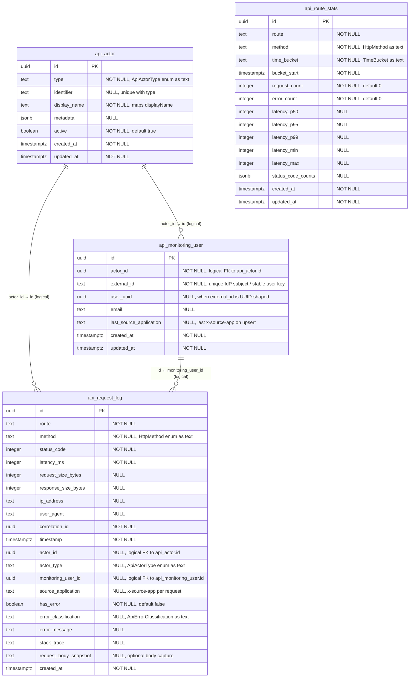

# ERD — `@exprealty/api-monitoring` (PostgreSQL `core` schema)

Entity definitions match **`@exprealty/api-monitoring`** TypeORM entities (v0.2.x). All tables live in schema **`core`**.

**Logical relationships**

- **`core.api_request_log.actor_id`** references **`core.api_actor.id`** (same UUID). The package stores this as a plain column; there is **no TypeORM `@ManyToOne` / DB `FOREIGN KEY`** in the published entity — enforce at the DB layer only if your org requires it.
- **`core.api_monitoring_user.actor_id`** references **`core.api_actor.id`** (logical). One profile row per stable **`external_id`** (IdP subject / user key), linked to the USER actor created by middleware.
- **`core.api_request_log.monitoring_user_id`** references **`core.api_monitoring_user.id`** (logical). Set when `ApiActorType.USER` was resolved and `ApiMonitoringUserService` upserted a profile for that request.
- **`core.api_request_log.source_application`** stores the normalized HTTP header **`x-source-app`** when present (e.g. `IMS`, `TRX`, deal desk). This is a **per-request** dimension: many humans can call from many apps; each log row records **one** user (when `monitoring_user_id` is set) and **one** source-app label for that HTTP call. There is **no separate “applications” table** and **no many-to-many** between users and apps—analytics use `GROUP BY` on `source_application` and/or joins to `api_monitoring_user`.
- **`core.api_request_log.retry_count`** stores **`x-retry-count`**: **0** for the original attempt (default), **1** for the first replay after a failure, **2** for the second, and so on. Each replay is a **new** log row; correlate replays with the same **`correlation_id`** (or your own idempotency key) if your pipeline sets it consistently across attempts.
- **`core.api_monitoring_user.last_source_application`** is updated on profile upsert when `x-source-app` is sent (convenience only; authoritative per-call app is on each `api_request_log` row).
- **`core.api_route_stats`** is **aggregated** from request logs (route + method + time bucket). There is **no foreign key** to `api_request_log` or `api_actor`.

### Association types (cardinality)

There are **no many-to-many** relationships between these four monitoring tables: there is **no join table** linking pairs of entities (e.g. no `api_request_log` ↔ `api_actor` through an intersection table). Links are **scalar UUID columns** only.

| From | To | Cardinality | Notes |
|------|-----|-------------|--------|
| `api_request_log` | `api_actor` | **Many-to-one** | Many log rows can share the same `actor_id` (same caller over time). |
| `api_request_log` | `api_monitoring_user` | **Many-to-one** | Many log rows can share the same `monitoring_user_id` (same human over time). Nullable when the caller has no USER profile row. |
| `api_monitoring_user` | `api_actor` | **Many-to-one** | Each profile has one `actor_id`. `actor_id` is not `UNIQUE`, so the DB could hold multiple profiles per actor only if data were inconsistent. |
| `api_route_stats` | *(other monitoring tables)* | **None (no FK)** | Stats are **derived** aggregates; no row-level link in this schema. |

**Intended pairing (not a separate many-to-many):** for `ApiActorType.USER`, the app normally maintains **one-to-one** between a human’s `api_actor` and their `api_monitoring_user` row (one stable `external_id` ↔ one profile ↔ one actor id from that flow). To **enforce** one profile per actor at the database level, add e.g. `UNIQUE (actor_id)` on `core.api_monitoring_user` in your own migration.

**TypeORM:** Entities use **plain `@Column` UUIDs**, not `@ManyToOne` / `@OneToMany` / `@ManyToMany` in the published package.

**PostgreSQL:** Relationships are **logical** unless your team adds `FOREIGN KEY` constraints.

---

## Diagram (Mermaid)

---

## Table: `core.api_actor`

| DB column | Type | Nullable | Notes |
|-----------|------|----------|--------|
| `id` | `uuid` | NO | PK, generated |
| `type` | `text` | NO | `ApiActorType` (see enums below) |
| `identifier` | `text` | YES | With `type`, unique (`idx_api_actor_type_identifier` unique) |
| `display_name` | `text` | NO | |
| `metadata` | `jsonb` | YES | Arbitrary JSON |
| `active` | `boolean` | NO | Default `true` |
| `created_at` | `timestamptz` | NO | |
| `updated_at` | `timestamptz` | NO | |

**Indexes:** unique `(type, identifier)`; `created_at`.

---

## Table: `core.api_monitoring_user`

| DB column | Type | Nullable | Notes |
|-----------|------|----------|--------|
| `id` | `uuid` | NO | PK |
| `actor_id` | `uuid` | NO | Logical → `api_actor.id` (USER actor) |
| `external_id` | `text` | NO | Stable unique key (e.g. Cognito `sub`, internal user id). **UNIQUE** |
| `user_uuid` | `uuid` | YES | Set when `external_id` parses as a UUID |
| `email` | `text` | YES | From auth / headers when available |
| `last_source_application` | `text` | YES | Last non-empty `x-source-app` seen when the profile is upserted |
| `created_at` | `timestamptz` | NO | |
| `updated_at` | `timestamptz` | NO | |

**Indexes:** unique `external_id`; index `actor_id`.

Populated by **`ApiMonitoringUserService.upsertForUserActor`** from **`ApiActorMiddleware`** when `ApiActorType.USER` is resolved (`metadata.userId` / identifier + email). When the request includes **`x-source-app`**, that value is passed into the upsert and stored in **`last_source_application`** (and on each **`api_request_log`** row via the interceptor).

---

## Table: `core.api_request_log`

| DB column | Type | Nullable | Notes |
|-----------|------|----------|--------|
| `id` | `uuid` | NO | PK, generated |
| `route` | `text` | NO | Matched route / path |
| `method` | `text` | NO | HTTP verb (`HttpMethod`) |
| `status_code` | `integer` | NO | HTTP status |
| `latency_ms` | `integer` | NO | |
| `request_size_bytes` | `integer` | YES | |
| `response_size_bytes` | `integer` | YES | |
| `ip_address` | `text` | YES | |
| `user_agent` | `text` | YES | |
| `correlation_id` | `uuid` | NO | Per-request correlation |
| `timestamp` | `timestamptz` | NO | Event time |
| `actor_id` | `uuid` | YES | → `api_actor.id` (logical) |
| `actor_type` | `text` | YES | Redundant type for queries |
| `monitoring_user_id` | `uuid` | YES | → `api_monitoring_user.id` (logical), USER flows |
| `source_application` | `text` | YES | Normalized **`x-source-app`** (client label: `IMS`, `TRX`, etc.) |
| `has_error` | `boolean` | NO | Default `false` |
| `error_classification` | `text` | YES | `ApiErrorClassification` |
| `error_message` | `text` | YES | |
| `stack_trace` | `text` | YES | Often server errors only |
| `request_body_snapshot` | `text` | YES | UTF-8 snapshot when `captureRequestBody` is enabled |
| `created_at` | `timestamptz` | NO | Row insert time |

**Indexes:** `timestamp`; `(route, method)`; `(actor_id, timestamp)`; `correlation_id`; `(status_code, timestamp)`; `(has_error, timestamp)`; `(monitoring_user_id, timestamp)`; `(source_application, timestamp)`.

**Header contract:** Upstream gateways or apps should send **`x-source-app`**: a short stable name for the calling product. The package reads it in **`ApiMonitoringInterceptor`** (every logged request) and in **`ApiActorMiddleware`** when upserting **`api_monitoring_user`**. Values are trimmed and limited to **64** characters; see **`parseSourceApplicationHeader`** and **`API_MONITORING_SOURCE_APP_HEADER`** on the package entry.

---

## Table: `core.api_route_stats`

| DB column | Type | Nullable | Notes |
|-----------|------|----------|--------|
| `id` | `uuid` | NO | PK, generated |
| `route` | `text` | NO | |
| `method` | `text` | NO | |
| `time_bucket` | `text` | NO | `minute` \| `hour` \| `day` |
| `bucket_start` | `timestamptz` | NO | Start of bucket |
| `request_count` | `integer` | NO | Default `0` |
| `error_count` | `integer` | NO | Default `0` |
| `latency_p50` | `integer` | YES | ms |
| `latency_p95` | `integer` | YES | ms |
| `latency_p99` | `integer` | YES | ms |
| `latency_min` | `integer` | YES | ms |
| `latency_max` | `integer` | YES | ms |
| `status_code_counts` | `jsonb` | YES | e.g. counts per status |
| `created_at` | `timestamptz` | NO | |
| `updated_at` | `timestamptz` | NO | |

**Constraints / indexes:** **Unique** `(route, method, time_bucket, bucket_start)` (`uq_api_route_stats_route_method_bucket`); indexes on `bucket_start`, `(route, method)`.

---

## Enum values stored as `text`

**`HttpMethod`:** `GET`, `POST`, `PUT`, `PATCH`, `DELETE`, `HEAD`, `OPTIONS`

**`ApiActorType`:** `user`, `api_key`, `service_account`, `anonymous`, `system`

**`ApiErrorClassification`:** `client_error`, `server_error`, `validation_error`, `auth_error`, `rate_limit_error`, `timeout_error`, `unknown_error`

**`TimeBucket`:** `minute`, `hour`, `day`

---

## Rendering the diagram

- **GitHub / GitLab:** Mermaid is supported in Markdown previews for many versions.
- **VS Code:** “Markdown Preview Mermaid Support” or similar extension.
- **Export PNG/SVG:** [Mermaid Live Editor](https://mermaid.live) — paste the `erDiagram` block.

---

*Generated from entity metadata in `@exprealty/api-monitoring`; verify against your installed version if types differ.*
