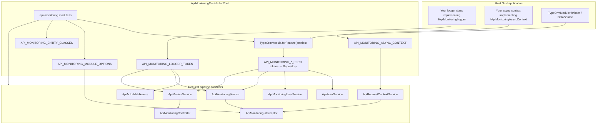
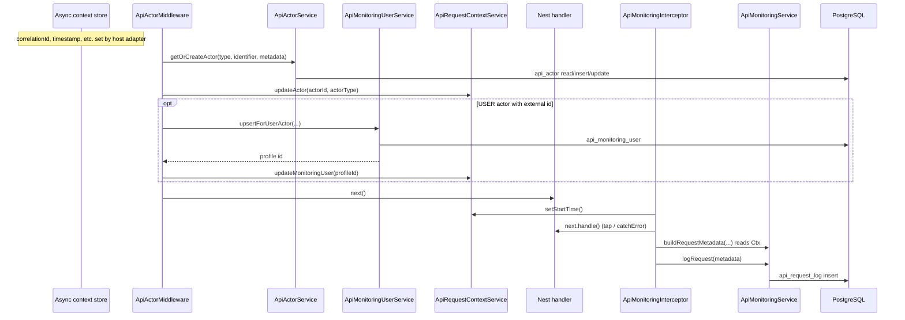
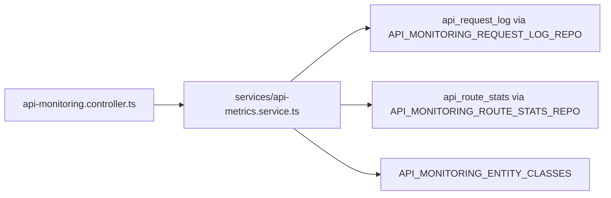

# Architecture — `@exprealty/api-monitoring`

This document describes how the package is structured, how major pieces talk to each other at runtime, and where to find them in `src/`. For database tables, columns, and HTTP header contracts, see **[api-monitoring.md](./api-monitoring.md)** (ERD and schema reference).

---

## 1. Big picture

The package is a **NestJS dynamic module** that wires:

| Concern | Mechanism | Primary artifacts |
|--------|-----------|-------------------|
| **Request attribution** | Middleware + async-local store | `ApiActorMiddleware`, `ApiRequestContextService`, host `IApiMonitoringAsyncContext` |
| **Per-request HTTP logging** | Global interceptor | `ApiMonitoringInterceptor`, `ApiMonitoringService`, `api_request_log` |
| **Dashboards / admin APIs** | REST controller | `ApiMonitoringController`, `ApiMetricsService`, DTOs |
| **Rollups for fast queries** | Service + optional HTTP trigger | `ApiMetricsService` → `api_route_stats` |
| **Persistence** | TypeORM feature module + custom repo tokens | Entities under `entities/`, tokens in `tokens/repository.tokens.ts` |

Everything is registered from **`ApiMonitoringModule.forRoot()`** in `api-monitoring.module.ts`: it imports `TypeOrmModule.forFeature(...)`, declares providers, registers **`APP_INTERCEPTOR`** for `ApiMonitoringInterceptor`, and mounts **`ApiMonitoringController`**.

---

## 2. Module composition (dependency injection)

The module is the **composition root**: it binds the host’s logger and async-context implementations, maps TypeORM repository tokens to the correct entity repositories, and exposes services for optional use in the host app.

**How to read this:** the host supplies **logger** and **async context**; the module wires **TypeORM repositories** into symbol tokens so services do not depend on raw `getRepositoryToken` strings.

---

## 3. HTTP request lifecycle (write path)

Typical order (your app must register **middleware after authentication** so `req.user` / API key stubs exist):

**File-level responsibilities on this path**

| Step | File(s) | What happens |
|------|---------|----------------|
| Correlation / store | Host implementation of `interfaces/async-context.port.ts` | Provides `getStore()` / `getCorrelationId()` backing ALS |
| Actor resolution | `middleware/api-actor.middleware.ts` | Reads `req.user` / API key shapes, calls actor + user services, updates context |
| Actor rows | `services/api-actor.service.ts` → `entities/api-actor.entity.ts` | Stable `api_actor` rows per `(type, identifier)` |
| User profile rows | `services/api-monitoring-user.service.ts` → `entities/api-monitoring-user.entity.ts` | Links USER actors to `external_id`, email, `last_source_application` |
| Context mutation | `services/api-request-context.service.ts` | Thin wrapper: `actorId`, `actorType`, `monitoringUserId`, `startTime` on the ALS store |
| Timing + headers + body snapshot | `interceptors/api-monitoring.interceptor.ts` | Uses `tokens/api-monitoring-module-options.token.ts` for capture limits; calls `utils/parse-source-application-header.util.ts`, `utils/parse-retry-count-header.util.ts`, `utils/serialize-request-body-snapshot.util.ts` |
| Metadata assembly + persist | `services/api-monitoring.service.ts` | `buildRequestMetadata()` merges route, status, latency, **context** (actor, monitoring user, correlation); `logRequest()` writes `entities/api-request-log.entity.ts` |
| Domain enums / shapes | `domain/api-monitoring.types.ts` | `HttpMethod`, `ApiActorType`, `ApiRequestMetadata`, error classification, etc. |

**Important:** `ApiMonitoringService.logRequest()` **skips** persistence when there is **no `actorId` in context** (middleware did not run or did not set an actor). That coupling is intentional: logs are always attributed when stored.

---

## 4. Admin / metrics path (read + aggregation)

`ApiMonitoringController` is the **only** HTTP entry for dashboard-style queries. It depends on **`ApiMetricsService`** and DTOs under `dto/`. Pagination helpers live in `utils/pagination.util.ts`.

- **Most GET endpoints** query **`api_route_stats`** first for performance, and may **fall back** to raw **`api_request_log`** for small windows when aggregates are missing (see comments in `api-metrics.service.ts`).
- **`GET .../aggregate`** (see controller) calls **`ApiMetricsService.aggregateAllRouteStats()`**, which reads logs and **upserts** **`api_route_stats`** — typically run on a schedule or manually, not on every HTTP request.

`ApiMetricsService` also uses **`API_MONITORING_ENTITY_CLASSES`** so it can reference the host’s entity classes (including custom replacements) when building queries that need table/column metadata.

---

## 5. Source layout (`src/`)

| Area | Role |
|------|------|
| `api-monitoring.module.ts` | `forRoot`: imports, providers, `APP_INTERCEPTOR`, controller, exports |
| `api-monitoring.controller.ts` | Swagger-documented admin routes → `ApiMetricsService` |
| `options/api-monitoring-for-root.options.ts` | Options type for `forRoot` (entities, connection name, logger token, async context class, body capture) |
| `interceptors/` | Global HTTP monitoring |
| `middleware/` | Actor attribution after auth |
| `services/` | Core business logic and DB access |
| `entities/` | TypeORM models + `default-entities.ts` bundle |
| `dto/` | Controller query/response shapes (class-validator / Swagger) |
| `domain/` | Shared enums and types (no Nest decorators) |
| `interfaces/` | **Ports**: logger, async context (host implements) |
| `tokens/` | DI symbols: repos, module options, entity class bundle |
| `utils/` | Pure helpers (headers, route normalization, pagination, filters, logging guards) |

---

## 6. Communication matrix (who calls whom)

**Middleware**

- `middleware/api-actor.middleware.ts` → `services/api-actor.service.ts`, `services/api-monitoring-user.service.ts`, `services/api-request-context.service.ts`, `utils/parse-source-application-header.util.ts`, `interfaces/logger.interface.ts`

**Interceptor**

- `interceptors/api-monitoring.interceptor.ts` → `services/api-monitoring.service.ts`, `services/api-request-context.service.ts`, `tokens/api-monitoring-module-options.token.ts`, header/body utils under `utils/`

**Logging service**

- `services/api-monitoring.service.ts` → `tokens/repository.tokens.ts` (request log repo), `services/api-request-context.service.ts`, `domain/api-monitoring.types.ts`, logger

**Metrics service**

- `services/api-metrics.service.ts` → request log + route stats repos, `tokens/entity-classes.token.ts`, logger; consumed only by `api-monitoring.controller.ts` for HTTP, and internally for aggregation helpers

**Context**

- `services/api-request-context.service.ts` → `interfaces/async-context.port.ts` only; **everyone** who needs actor or correlation reads this (interceptor, monitoring service)

---

## 7. Public surface

`src/index.ts` re-exports the module, entities, ports, services, middleware, interceptor, controller, and selected DTOs/utils for consumers that extend or wire the package explicitly.

---

## 8. Related documentation

- **[api-monitoring.md](./api-monitoring.md)** — PostgreSQL `core` schema, ERD, headers (`x-source-app`, `x-retry-count`), and request lifecycle from a **data** perspective.
- **Package README** — installation, `forRoot` example, middleware ordering, env flags (`API_MONITORING_ENABLED`, `API_MONITORING_SAMPLE_RATE`).
